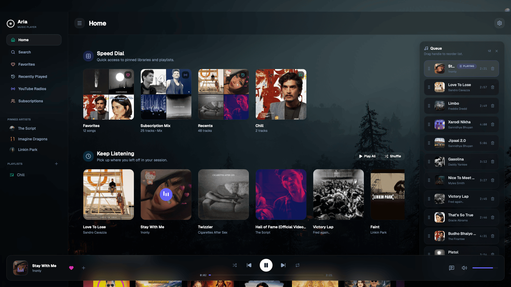
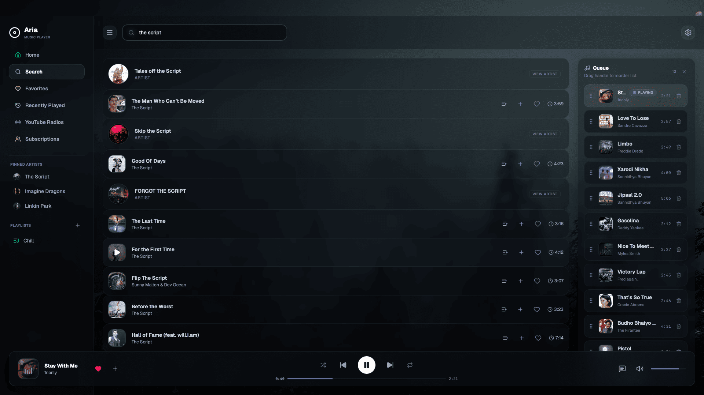
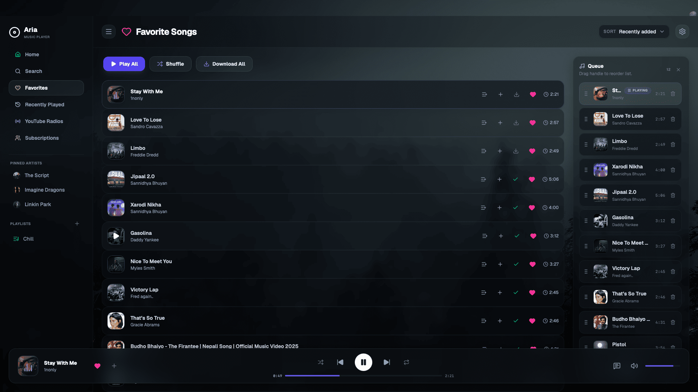
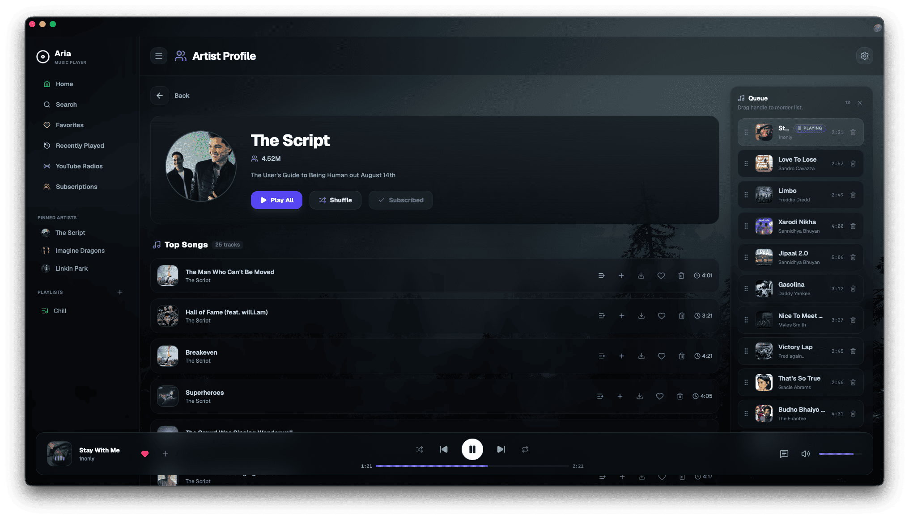
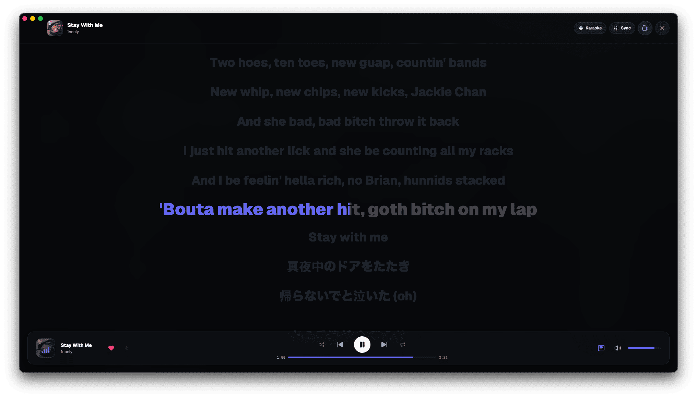
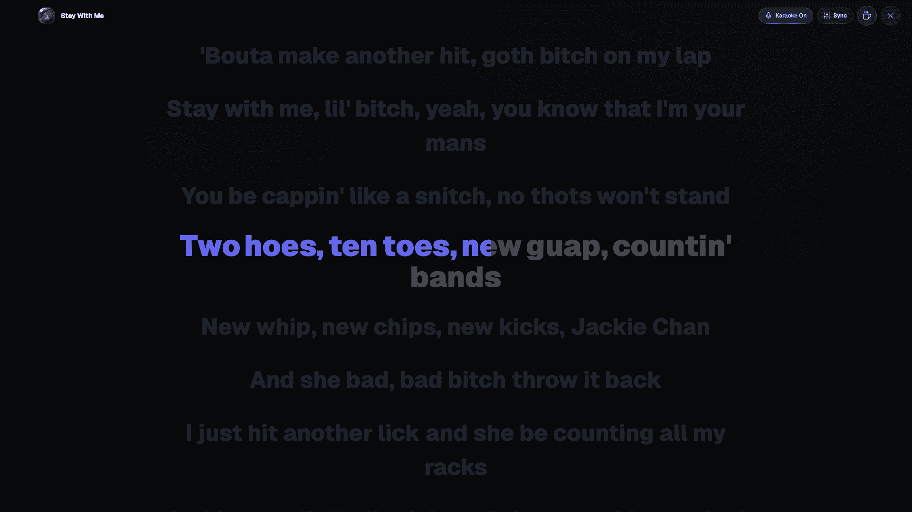
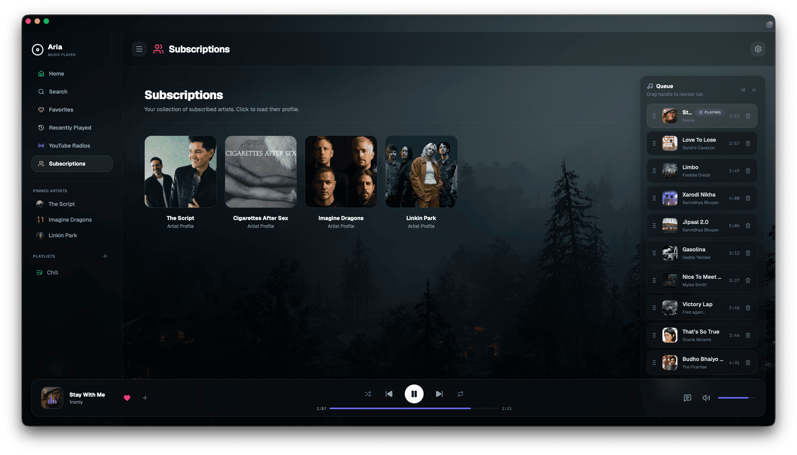

# Aria 🎵

A modern, lightweight, cross-platform desktop music player built with **Tauri**, **React**, and **Rust**.

Fast • Native • Beautiful

---

## ✨ Features

- 🎵 Modern desktop music player
- ⚡ Native performance powered by Rust and Tauri
- 🎨 Clean and responsive user interface
- 📚 Playlist management
- ❤️ Favorites library
- 🔍 Fast music search
- ⏯️ Rich playback controls
- 🎧 Queue management
- 🌙 Beautiful dark theme
- 💻 Cross-platform support

---

## 📸 Screenshots

### 🏠 Home

---

### 🔍 Search

---

### ❤️ Favorites

---

### 🎤 Artist Profile

---

### 📝 Lyrics

---

### 🎤 Karaoke Mode

---

### 📻 Subscriptions

---

## 🚀 Tech Stack

### Frontend

- React
- TypeScript
- Vite
- Tailwind CSS
- Lucide React

### Backend

- Rust
- Tauri v2

---

## 🖥️ Supported Platforms

| Platform              | Status |
| --------------------- | ------ |
| Windows               | ✅     |
| macOS (Apple Silicon) | ✅     |
| Linux                 | ✅     |

